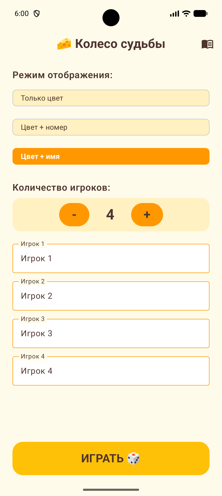
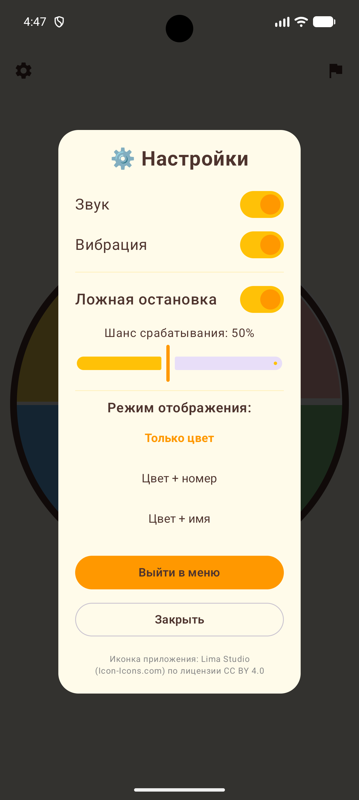
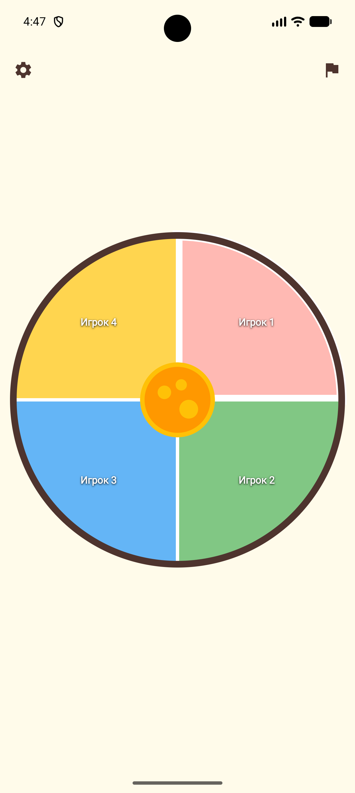
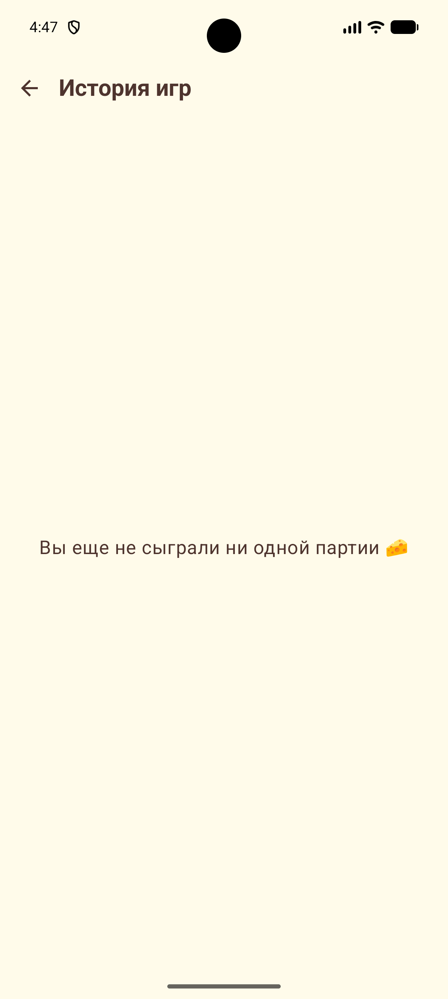

# 🧀 CheeseRoul (Сырная Рулетка)

**CheeseRoul** — это веселая, интерактивная и гибко настраиваемая игра-рулетка для компаний, полностью написанная с использованием современных инструментов Android-разработки. Нужно принять сложное решение, выбрать, кто платит за счет, или просто развлечься с друзьями? Сырная рулетка всё решит!

### 📥 Скачать приложение

*🟩 **Release (Stable)** — стабильная версия игры. Нажмите, чтобы перейти к последнему официальному релизу.*
*🟥 **Beta (Debug)** — тестовая версия с новейшими фичами. Нажмите, чтобы перейти в раздел Actions и скачать артефакт последней сборки ветки develop.*

---

## ✨ Главные фишки

* **🎨 Кастомный рендеринг на Canvas:** Колесо рулетки отрисовано полностью с нуля с помощью Jetpack Compose `Canvas`, что обеспечивает идеальное масштабирование на любых экранах.
* **🚀 Продвинутая физика и частицы (v2.0):** Плавнейшее вращение на основе математических кривых Безье, 3 уникальных режима анимации колеса и встроенный 60FPS-движок частиц (дождь из сыра и вылетающие искры!).
* **🎭 Эпичные эффекты выбывания:** Когда игрок выбывает, его сектор физически реагирует! Выбирайте эффекты: *Взрыв (Сверхновая)*, *Улёт в корзину*, *Угасание (Призрак)*, *Сжатие (Чёрная дыра)* или *Случайный*.
* **😈 Механика «Ложной остановки»:** Встроенная тролль-фича, которая с определенным шансом заставляет колесо перескочить на другой сектор в самую последнюю долю секунды (сопровождается специальным звуком и вибрацией).
* **⚙️ Глубокая настройка:**
  * От 2 до 7 игроков.
  * Три режима отображения секторов: Только цвета, Цвета + Номера, Цвета + Имена.
  * Тонкая настройка звука, вибрации и вероятности срабатывания «Ложной остановки».
* **📊 История матчей:** Автоматическое сохранение победителя, первого выбывшего игрока, длительности сессии и количества выпадений на каждого игрока.

> **Примечание:** Мы постоянно улучшаем приложение 🧀, так что реальный вид экранов может немного отличаться от того, что вы видите здесь.

  
  &nbsp;&nbsp;&nbsp;
  
  &nbsp;&nbsp;&nbsp;
  
  &nbsp;&nbsp;&nbsp;
  

## 🚀 Как запустить проект

1. Откройте проект в **Android Studio** (рекомендуется версия Ladybug или новее).
2. Дождитесь синхронизации Gradle и скачивания всех зависимостей.
3. Запустите приложение на эмуляторе или физическом устройстве (API 24+).

## 📂 Структура проекта

* `model/` — Data-классы (`Player`, `GameStat`) и перечисления (`SpinAnimationMode`, `EliminationEffect`).
* `viewmodel/` — Содержит `RouletteViewModel`, управляющую ядром игровой логики, историей и настройками.
* `ui/components/` — Переиспользуемые UI-элементы, включая сложный Canvas-компонент `RouletteWheel` и кастомную кнопку `CheeseButton`.
* `ui/screens/` — Основные экраны приложения (`SetupScreen`, `GameScreen`, `HistoryScreen`).
* `utils/` — Хелперы для работы с аппаратной частью смартфона (`SoundManager`, `VibrationManager`).

## 🛠️ Технологии и Архитектура

* **UI Фреймворк:** Jetpack Compose (Material Design 3)
* **Архитектура:** MVVM (Model-View-ViewModel) с однонаправленным потоком данных (UDF)
* **Управление состоянием:** Kotlin StateFlow & MutableStateFlow
* **Многопоточность:** Kotlin Coroutines (для расчета физики колеса, плавного замедления и анимаций)
* **Навигация:** Compose Navigation
* **Отклик:** VibratorManager & SoundManager (ToneGenerator)
* **Графика:** Canvas API, Custom Particle Engine, Animatable, animateFloatAsState

## 📜 Лицензия

Исходный код распространяется под лицензией MIT.
Иконка приложения предоставлена [Lima Studio (Icon-Icons.com)](https://icon-icons.com/) по лицензии **CC BY 4.0**.

---
*Сделано с ❤️ и 🧀 на Jetpack Compose.*